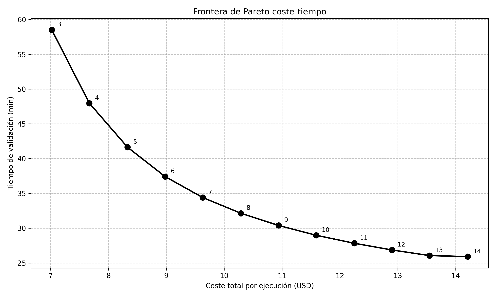

# Optimización multicriterio de pipelines de pruebas automatizadas en integración continua

[](https://github.com/pedromorago/tfg-optimizacion-pipelines/actions/workflows/ci.yml) [](https://doi.org/10.5281/zenodo.20691511)
 
Código y datos de ejemplo del Trabajo de Fin de Grado del mismo título. El trabajo modela la planificación de una suite de pruebas automatizadas sobre contenedores paralelos de integración continua como un problema de optimización multicriterio (MILP, frontera de Pareto y Programación por Objetivos), validado sobre datos reales de un pipeline en producción.
 
- **Autor:** Pedro Morago López-Vázquez
- **Directora:** Lidia Sánchez Ruiz
- **Grado en Matemáticas, Facultad de Ciencias, Universidad de Cantabria**
- **Curso 2025-2026**

## Resumen ejecutivo

Resultados principales del estudio (74 archivos *spec* repartidos sobre contenedores paralelos):

- **Configuración base (7 contenedores):** 34,41 min y 9,63 USD por ejecución, frente a los 59,73 min de la asignación manual original con el mismo coste.
- **Escenario saneado (7 contenedores):** 30,57 min y 8,56 USD, referencia de la mejora alcanzable si se elimina la inestabilidad de las pruebas.
- **Número de contenedores libre:** 25,93 min con 14 contenedores, el mínimo tiempo de validación alcanzable.

## Estructura del repositorio
 
```
.
├── codigo/                        # scripts de Python
│   ├── extraccion_empirica_base.py
│   ├── extraccion_empirica_original.py
│   ├── extraccion_empirica_optimizada.py
│   ├── generar_datos_real.py
│   ├── generar_datos_real_optimizados.py
│   ├── generar_datos_saneado.py
│   ├── analisis_flakys.py
│   ├── ppo_base.py
│   ├── ppo_caso_a_validacion_base.py
│   ├── ppo_caso_b_contencion_coste.py
│   ├── ppo_caso_c_prioridad_tiempo.py
│   ├── ppo_caso_d_setup_adverso.py
│   ├── generar_pareto.py
│   ├── prueba_real_7_conts.py
│   ├── prueba_saneado_7_conts.py
│   └── configuracion_n_libre.py
├── ejemplo_logs/                  # logs sintéticos de ejemplo
│   ├── pipeline-regression-1.log
│   ├── pipeline-regression-2.log
│   └── README.md
├── logs_anonimizados/             # logs reales anonimizados (escenario base)
├── logs_anonimizados_optimizados/ # logs reales anonimizados (escenario optimizado)
├── datos_derivados/               # dataset derivado del estudio (tiempos por spec)
├── resultados_referencia/         # salidas de referencia de la optimización
├── Resultados/                    # (generada) salidas de los scripts
├── README.md
├── requirements.txt
├── .gitignore
└── LICENSE
```
 
Los scripts están pensados para ejecutarse desde la carpeta `codigo/`: los de la etapa de datos leen de `../logs_anonimizados/` y `../logs_anonimizados_optimizados/`, y todos escriben en `../Resultados/` (se crea automáticamente). Las rutas son constantes al inicio de cada script; si reorganizas los ficheros, ajústalas ahí.
 
## Requisitos
 
- Python 3.12 (probado en 3.12.3).
- Dependencias: `pip install -r requirements.txt` (pulp para los modelos, matplotlib para la frontera de Pareto).

Preparación del entorno (opcional pero recomendado):

```bash
python -m venv .venv
source .venv/bin/activate        # En Windows: .venv\Scripts\activate
python -m pip install --upgrade pip
python -m pip install -r requirements.txt
```

## Datos
 
Los logs reales del pipeline de CI se publican **anonimizados**: los nombres de producto, módulos, specs, tests, contenedores y trabajos de CI se sustituyeron por equivalentes ficticios, con las mismas correspondencias en todos los ficheros; los identificadores internos, por valores ficticios consistentes (el mismo identificador real recibe siempre el mismo sustituto); las URLs del gestor de pruebas se neutralizaron; y las fechas se desplazaron un número fijo de días, conservando la cronología relativa entre ejecuciones. Los logs se han reducido además a las líneas de resultado de cada test, con las descripciones de los casos generalizadas; se conservan intactos el estado y el tiempo de cada test, de modo que los scripts de preprocesado producen los mismos números agregados que sobre los originales. El proceso de anonimización y su mapa de correspondencias no forman parte del repositorio.
 
- `logs_anonimizados/` contiene las 56 ejecuciones del escenario base: 7 módulos, suites sanity y regression, 4 ciclos.
- `logs_anonimizados_optimizados/` contiene las 14 ejecuciones de validación tras desplegar la configuración optimizada (un ciclo de los mismos 7 módulos).
- `ejemplo_logs/` contiene dos logs **sintéticos** mínimos que reproducen el formato real y cubren los cuatro casos relevantes para el preprocesado: un test estable, un test inestable que falla y luego pasa, un test que siempre falla y un test omitido. Permiten entender la etapa de extracción de datos en unos minutos. Véase `ejemplo_logs/README.md`.
- Los **datos derivados** (tiempos por especificación) que alimentan los modelos están embebidos como diccionarios dentro de los propios scripts de optimización, de modo que la parte de optimización es reproducible incluso sin los logs. Ese conjunto de datos, junto con el de las ejecuciones de validación, está disponible además como ficheros independientes en `datos_derivados/`.
 
## Reproducir los resultados
 
Desde la carpeta `codigo/`.
 
Etapa de datos, sobre los logs anonimizados publicados (reproduce los números de la memoria):
 
```bash
python generar_datos_real.py             # diccionario de tiempos reales
python generar_datos_saneado.py          # diccionario saneado (sin fallos)
python analisis_flakys.py                # deuda técnica y tests inestables
python generar_datos_real_optimizados.py # tiempos del escenario optimizado
```
 
Para un primer contacto con la etapa de extracción sirve el conjunto mínimo de ejemplo: apunta la constante `RUTA_LOGS` del script (por defecto `../logs_anonimizados/`) a `../ejemplo_logs/` y los tres primeros scripts producen salidas con el mismo formato sobre datos de ejemplo.
 
Optimización (valores del TFG sobre los datos reales):
 
```bash
python prueba_real_7_conts.py       # N=7 real     -> makespan 34.41 min, coste 9.63 USD
python prueba_saneado_7_conts.py    # N=7 saneado  -> makespan 30.57 min, coste 8.56 USD
python configuracion_n_libre.py     # N libre      -> N=14, makespan 25.93 min, coste 14.21 USD
python generar_pareto.py            # frontera de Pareto coste-tiempo (tabla + PNG, N=3..14)
python ppo_caso_a_validacion_base.py # Programación por Objetivos, caso A (análogos: b, c, d)
```
 
Cada script escribe su salida en `../Resultados/`, que se crea automáticamente si no existe. Con los logs anonimizados, las salidas de la etapa de datos coinciden exactamente con las recogidas en `resultados_referencia/`.
 
## Resultados de referencia
 
La carpeta `resultados_referencia/` contiene las salidas de los scripts de optimización y de extracción empírica tal y como se obtuvieron para la memoria, usando Python 3.12, PuLP 3.3.2 y el solver CBC incluido en esa versión. Estos ficheros permiten consultar los resultados principales o compararlos con una nueva ejecución sin necesidad de resolver de nuevo todos los modelos.
 
En una nueva ejecución, el coste y el makespan deberían reproducir los valores recogidos en estos ficheros hasta la precisión reportada, salvo pequeñas diferencias debidas al redondeo, a las tolerancias del solver o a cambios menores en el entorno de ejecución. La asignación concreta de specs a contenedores puede diferir, ya que el modelo puede encontrar un óptimo alternativo equivalente o una solución prácticamente equivalente, manteniendo el mismo comportamiento agregado en términos de coste y tiempo de validación.
 
La frontera de Pareto de referencia se genera para `N=3..14` contenedores con CBC, usando un límite de tiempo de 120 segundos por instancia, `gapRel = 0.0` y `gapAbs = 0.00095 min`, en coherencia con los parámetros definidos en `codigo/generar_pareto.py`.
 
Todas las salidas son regenerables desde el propio repositorio: las de optimización, a partir de los datos embebidos en los scripts; las de la etapa de datos, incluido el reporte de inestabilidad, a partir de los logs anonimizados publicados. El conjunto de datos derivado de esos logs se proporciona en la carpeta `datos_derivados/`.
 

 
## Disponibilidad de datos y código
 
El código está disponible íntegramente en este repositorio bajo licencia MIT. Los logs del pipeline se publican anonimizados, junto a un conjunto sintético mínimo de ejemplo y los datos derivados, siguiendo el principio "tan abierto como sea posible, tan cerrado como sea necesario": la anonimización sustituye la información identificativa del pipeline original (nombres, identificadores, URLs y fechas) por equivalentes ficticios consistentes y conserva intactos los resultados de los tests, de modo que el flujo completo, de los logs a las tablas de la memoria, es reproducible y verificable de principio a fin.
 
## Licencia
 
El código se distribuye bajo licencia MIT (véase el fichero `LICENSE`).
 
## Cómo citar
 
Morago López-Vázquez, P. *Optimización multicriterio de pipelines de pruebas automatizadas en integración continua*. Trabajo de Fin de Grado, Grado en Matemáticas, Universidad de Cantabria, 2026. Código y datos archivados en Zenodo: https://doi.org/10.5281/zenodo.20691511